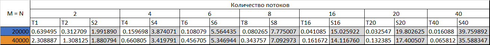
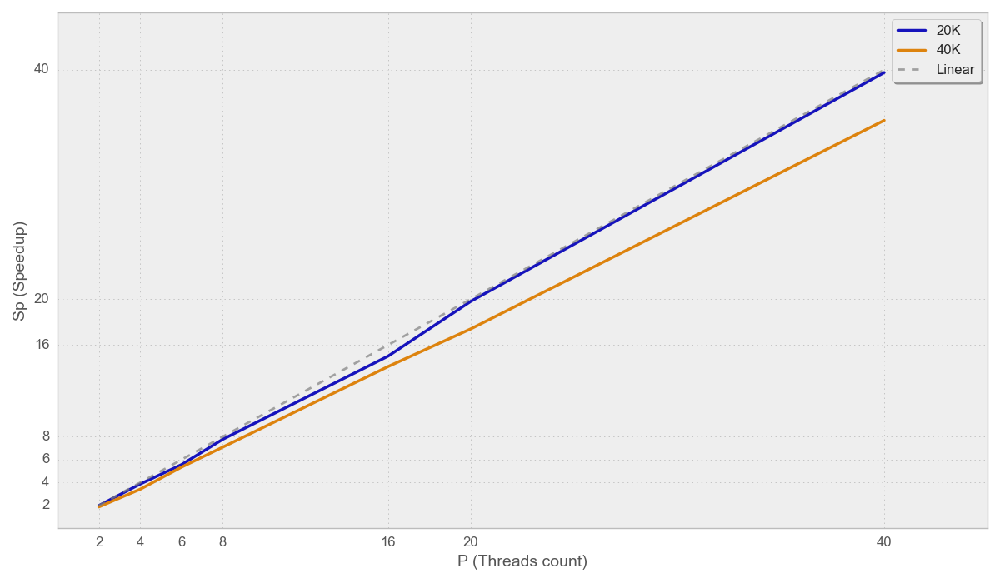
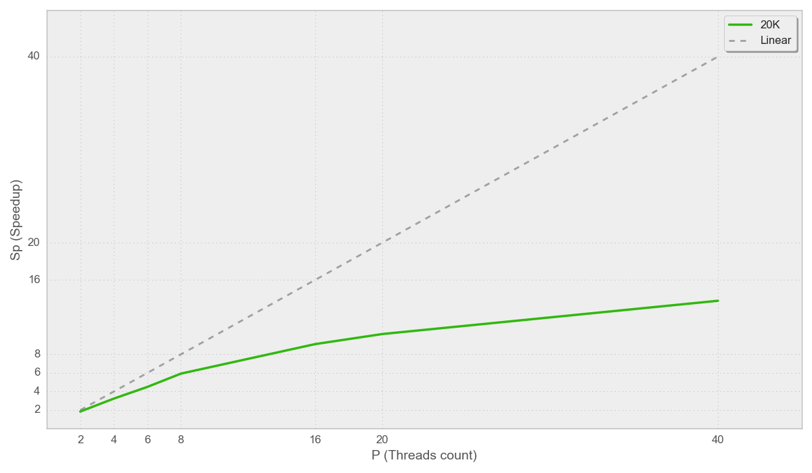
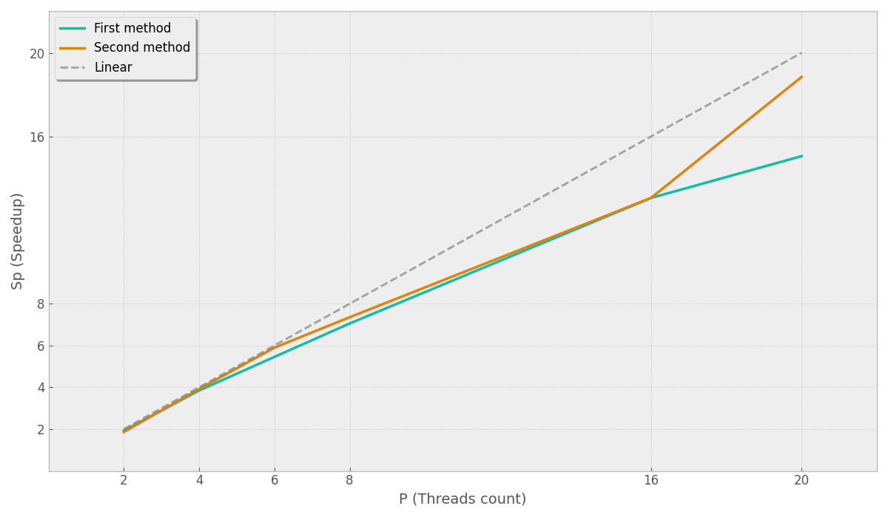

## Общая информация 

| **Сервер**                   | ProLiant XL270d Gen10                    |
| ---------------------------- | ---------------------------------------- |
| **ОС**                       | Ubuntu 22.04.5 LTS (Jammy Jellyfish)     |
| **Архитектура**              | x86_64, Little Endian                    |
| **Процессор**                | Intel® Xeon® Gold 6248 @ 2.50GHz         |
| **Сокеты**                   | 2                                        |
| **Ядер на сокет**            | 20                                       |
| **Потоков на ядро**          | 2 (Hyper-Threading)                      |
| **Всего логических CPU**     | 80                                       |
| **NUMA-ноды**                | 2                                        |
| **Нода 0: CPU 0-19, 40-59**  | distance: 10 (local), 21 (remote)        |
| **Нода 1: CPU 20-39, 60-79** | distance: 21 (remote), 10 (local)        |
| **Память на ноду**           | ~386 ГБ (node 0: 385 ГБ, node 1: 387 ГБ) |

## Задание 1:  Умножение матрицы на вектор

### Реализация программы

Реализована многопоточная версия умножения матрицы на вектор с параллельной инициализацией.
Сборка: CMake. Вычисления на сервере. 
Тип: double. 
Размеры: 20000x20000, 40000x40000.
### Анализ масштабируемости

*(Таблица 1)*

*(График 1)*

### Вывод о масштабируемости

Для матрицы 20000×20000 ускорение практически линейно до 40 потоков (39.76 при идеальных 40.00), что свидетельствует о высокой эффективности параллелизации. Для большей матрицы (40000×40000) ускорение немного ниже, особенно при большом числе потоков. Возможно это объясняется увеличением нагрузки на подсистему памяти, а также возможными эффектами NUMA при доступе к данным, расположенным в удалённой ноде.

**Вывод:** Алгоритм демонстрирует отличную масштабируемость на данном вычислительном узле. Небольшое отклонение от линейности при увеличении размера задачи связано с ограничениями пропускной способности памяти и архитектурными особенностями NUMA.

## Задание 2: Вычисление интеграла

### Реализация программы

Реализована параллельная версия численного интегрирования.
Сборка: CMake. Вычисления на сервере. 
`nsteps` = 40 000 000.

### Анализ масштабируемости

*(График 2)*

### Вывод о масштабируемости

При 2–8 потоках эффективность составляет 74–92%, что указывает на корректную параллелизацию и низкие накладные расходы. Дальше эффективность растет, но не так сильно. Возможная причина заключается в том, что даже с локальными переменными `local_sum`, финальное сложение в глобальную `sum` требует эксклюзивного доступа к памяти и при 40 потоках каждый поток вынужден ждать, пока другие завершат атомарную операцию => возникает серийный участок кода.

**Вывод:** Алгоритм численного интегрирования показывает удовлетворительную масштабируемость до 8–16 потоков.

## Задание 3

### Реализация программы

Реализована параллельная версия метода простой итерации  для системы $Ax = b$
Сборка: CMake. Вычисления на сервере.

### Анализ масштабируемости

!
*(График 3)*

### Вывод о масштабируемости

Метод 2 (единая параллельная секция) предпочтительнее для итерационных алгоритмов. Оптимальное число потоков для данной задачи: 16–20. Дальнейшее увеличение даёт незначительный прирост при росте потребления ресурсов; cтратегия планирования влияет на производительность: использование `schedule` может улучшить результат на 5–10%, особенно при неравномерной нагрузке. В ходе экспериментов оптимальным параметром был выбран `static`.

